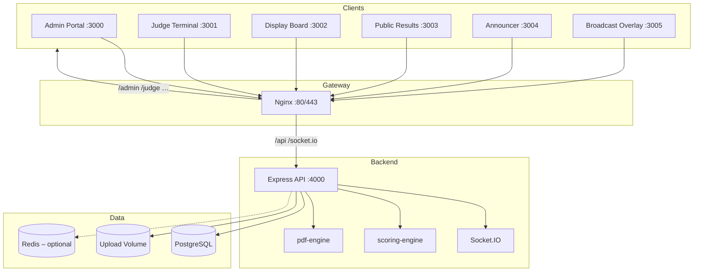

# AeroJudge

**AeroJudge by Nepalabs — Professional Competition Management Platform for Air Sports**

A commercial SaaS monorepo for running air sports competitions. The initial release focuses on **paragliding accuracy** in compliance with the FAI Sporting Code Section 7C. AeroJudge covers registration, round management, live scoring, dual approval workflows, PDF reporting, public results, venue displays, and broadcast overlays.

Organizations (e.g. NPHA, FAI, APPI, or any federation) are first-class tenants that own competitions — not baked into the product. Manage them under Admin → Organizations.

See also [docs/PRODUCT.md](docs/PRODUCT.md).

---

## Features

- **Organization management** — Multi-tenant orgs own competitions, branding, and SaaS plan limits
- **Competition lifecycle** — Draft → registration → practice → official rounds → publish → archive
- **Pilot & team management** — CSV import, QR/barcode lookup, national team validation (3+1 reserve)
- **Round operations** — Random/seeded flight order, launch control, pause/resume, reflight rounds
- **Live scoring** — Touch-optimised judge terminal with bullseye shortcuts, offline queue sync
- **FAI scoring engine** — Isolated `@npha/scoring-engine` package with configurable rule profiles (FAI 2022, national/local, custom)
- **Approval workflow** — Chief Judge + Competition Director sign-off before results lock
- **Rankings** — Individual, team, women, junior, and country categories with tie-break rules
- **PDF reports** — Round score sheets, start lists, final results with QR links to public results
- **Real-time updates** — Socket.IO for displays, announcer, and admin dashboards
- **Public results** — SEO-friendly slug-based leaderboard (`/results/?slug=…`)
- **Role-based access** — 10 roles from Super Admin to Display Operator
- **Audit trail** — Immutable log of score changes, approvals, and configuration updates
- **Docker deployment** — Single-command production stack with Nginx reverse proxy

---

## Architecture



---

## Tech Stack

| Layer | Technologies |
|-------|-------------|
| **Frontend** | React 18, Vite 5, TypeScript, Tailwind CSS, TanStack Query, Socket.IO client |
| **Backend** | Node.js 20, Express 4, Socket.IO, Zod, JWT auth |
| **Database** | PostgreSQL 15, Prisma ORM |
| **Shared** | Turborepo npm workspaces |
| **Testing** | Vitest (unit), Playwright (e2e) |
| **Deployment** | Docker Compose, multi-stage Nginx builds |

---

## Quick Start

### Prerequisites

- Node.js ≥ 20, npm ≥ 10
- PostgreSQL 15 (local or Docker)
- Copy `.env.example` → `.env` and adjust secrets

### Local development

```bash
# Install dependencies
npm install

# Generate Prisma client & run migrations
npm run db:generate
npm run db:migrate

# Seed demo competition (optional)
npm run db:seed

# Start all apps (or use ./scripts/dev-all.sh for port reminder)
npm run dev
```

Open **http://localhost:3000** (admin) and **http://localhost:4000/api/docs** (Swagger).

### Docker (production-like)

```bash
# Copy docker env template (optional)
cp docker/.env.example docker/.env

# Build and start full stack
npm run docker:up

# View logs
npm run docker:logs

# Stop
npm run docker:down
```

Access via **http://localhost** (Nginx routes all apps).

---

## Default Credentials (local seed)

Sample seed data uses **NPHA as an example organization** (early customer / demo tenant), not as the product brand.

| Role | Email | Password |
|------|-------|----------|
| **Super Admin** | `admin@npha.org.np` | `NphaAdmin@2024!` |
| Competition Director | `director@npha.org.np` | `Director@2024!` |
| Chief Judge | `chiefjudge@npha.org.np` | `ChiefJudge@2024!` |
| Judge | `judge@npha.org.np` | `Judge@2024!` |
| Scorekeeper | `scorekeeper@npha.org.np` | `Scorekeeper@2024!` |

> Change all passwords before any production deployment.

---

## Apps & Ports

| App | Dev URL | Purpose |
|-----|---------|---------|
| Admin | http://localhost:3000 | Competition management (org RBAC) |
| Judge | http://localhost:3001 | Touch scoring (login + org context) |
| Display | http://localhost:3002 | Venue leaderboards (`/competition/:id`) |
| Public Results | http://localhost:3003 | Public leaderboard (`/competition/:id`) |
| Announcer | http://localhost:3004 | Live announcements (`/competition/:id`) |
| Broadcast Overlay | http://localhost:3005 | OBS browser source (`/competition/:id`) |
| API | http://localhost:4000/api/v1 · Swagger `/api/docs` | REST + Socket.IO |

Seed sample competitions appear on each app’s home list when published with public results enabled. Legacy `?competition=` and `/:slug` URLs redirect to `/competition/:id`.

---

## FAI Compliance Notes

AeroJudge implements **FAI Sporting Code Section 7C** (Paragliding Accuracy) for **Category 2** events:

- Distance measured in centimetres from target centre; bullseye = 0 cm, maximum = 1000 cm (configurable)
- Team scoring: best 3 of 4 pilots per round (reserve substitution rules supported)
- Worst-round discard after configurable minimum rounds flown
- Tie-break order: bullseyes → best single score → best last round → pilot number
- Dual approval: Chief Judge and Competition Director must approve before round results lock
- Full audit trail retained for protest periods and FAI record requests

Rule profiles are versioned (`FAI_2022`, `NPHA_LOCAL`, `CUSTOM`, etc.) per competition — the `NPHA_LOCAL` identifier is a legacy profile key for a national/local adaptation sample, not product branding. See [docs/architecture/OVERVIEW.md](docs/architecture/OVERVIEW.md).

---

## Development Commands

```bash
npm run dev              # Start all workspaces in parallel
npm run build            # Production build (turbo)
npm run test             # Unit tests
npm run test:e2e         # Playwright e2e tests
npm run lint             # Lint all packages
npm run typecheck        # TypeScript check
npm run format           # Prettier write
npm run db:generate      # Prisma generate
npm run db:migrate       # Prisma migrate dev
npm run db:seed          # Seed demo data
npm run db:reset         # Reset DB + re-seed
npm run docker:up        # Docker Compose up
npm run docker:down      # Docker Compose down
npm run docker:logs      # Follow container logs
./scripts/dev-all.sh     # Dev with port reminder banner
```

---

## Documentation

| Guide | Description |
|-------|-------------|
| [Product](docs/PRODUCT.md) | AeroJudge vision and roadmap |
| [Installation](docs/guides/INSTALLATION.md) | Prerequisites, env, migrate, seed |
| [Competition Operations](docs/guides/COMPETITION_OPS.md) | Running a competition day |
| [API Reference](docs/api/API.md) | `/api/v1` endpoint overview |
| [Architecture Overview](docs/architecture/OVERVIEW.md) | Clean architecture & workflows |
| [ER Diagram](docs/architecture/ER_DIAGRAM.md) | Database entity relationships |

---

## Project Structure

```
aerojudge-accuracy-cms/
├── apps/                  # Vite React frontends
│   ├── admin/
│   ├── judge/
│   ├── display/
│   ├── public-results/
│   ├── announcer/
│   └── broadcast-overlay/
├── packages/
│   ├── shared/            # Zod schemas, types
│   ├── scoring-engine/    # FAI scoring logic (isolated)
│   ├── pdf-engine/        # Report generation
│   ├── ui/                # Shared UI components
│   └── utils/
├── server/                # Express API + Socket.IO
├── database/              # Prisma schema, migrations, seed
├── docker/                # Docker Compose, Dockerfiles, Nginx
├── e2e/                   # Playwright tests
├── docs/                  # Guides & architecture docs
└── uploads/               # Runtime file storage
```

> GitHub: [Pratap22/aerojudge-accuracy-cms](https://github.com/Pratap22/aerojudge-accuracy-cms). Workspace package names (`@npha/*`) are technical identifiers and may be renamed in a future migration. User-facing branding is **AeroJudge**.

---

## License

[MIT](LICENSE) — Copyright © 2024–2026 Nepalabs
