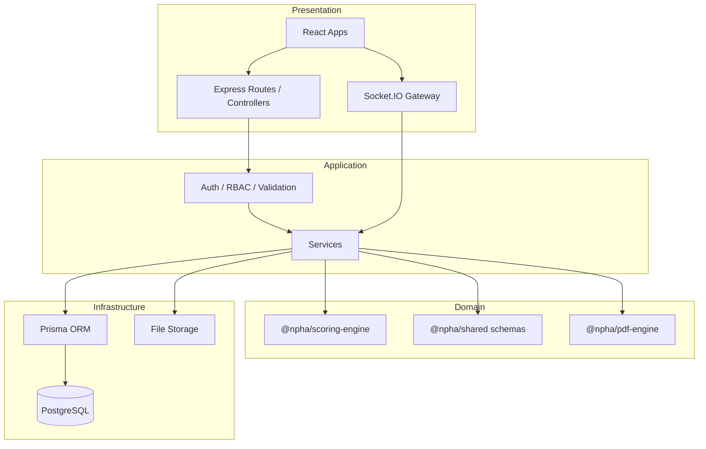
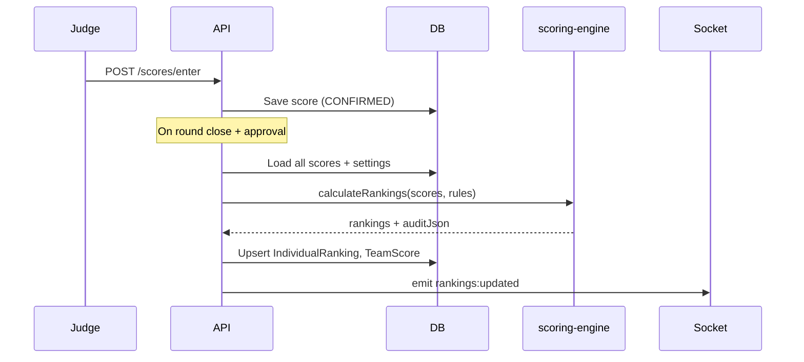
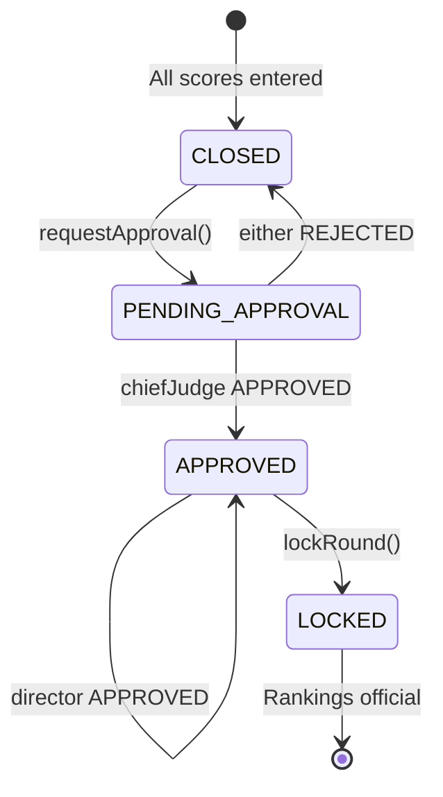
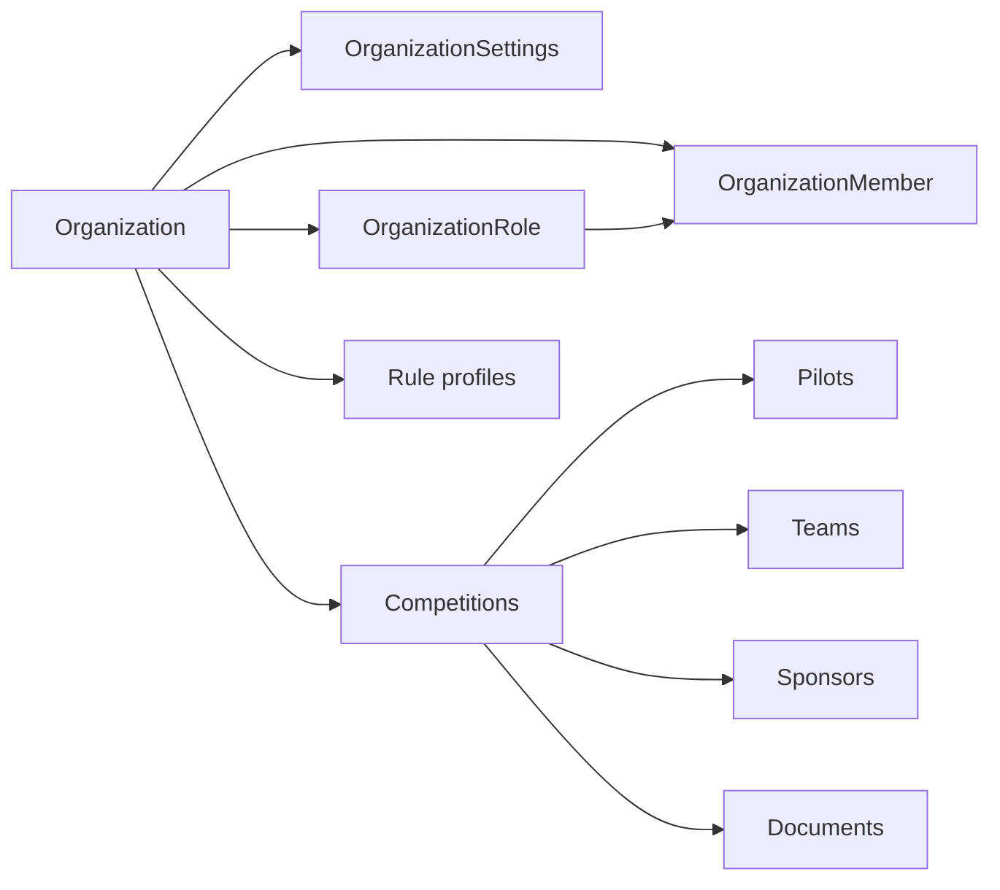
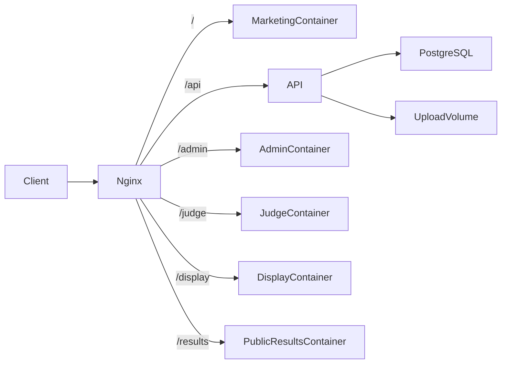

# Architecture Overview

AeroJudge follows a **clean architecture** pattern with strict separation between presentation, application, domain logic, and infrastructure.

---

## Layer diagram



---

## Monorepo packages

| Package | Layer | Responsibility |
|---------|-------|----------------|
| `apps/*` | Presentation | Role-specific React UIs |
| `server` | Application | HTTP API, auth, orchestration |
| `@npha/shared` | Domain | Zod schemas, shared TypeScript types |
| `@npha/scoring-engine` | Domain | **Pure** FAI scoring calculations |
| `@npha/pdf-engine` | Domain | PDF report generation |
| `@npha/ui` | Presentation | Shared React component library |
| `@npha/database` | Infrastructure | Prisma schema & client |
| `@npha/utils` | Domain | Shared utilities |

---

## Scoring engine isolation

The `@npha/scoring-engine` package is deliberately **framework-agnostic**:

- No imports from Express, Prisma, or React
- Accepts plain JSON rule profiles and score arrays
- Returns calculated rankings with full audit payloads (`auditJson`)
- Unit tested independently of the API

This isolation ensures:

1. **FAI compliance verification** — Scoring logic can be audited without reading the full codebase
2. **Deterministic recalculation** — Same inputs always produce same outputs
3. **Rule versioning** — `RuleProfile` records store frozen rule JSON per competition
4. **Testability** — Vitest tests cover edge cases (discards, tie-breaks, team best-3)

### Scoring flow



Rule profiles are loaded from `RuleProfile.rulesJson` or `CompetitionSettings` with fallback to `FAI_2022` defaults in `packages/scoring-engine/src/rules/profiles.ts`.

---

## Approval workflow

Round results require **dual approval** when `requireChiefJudgeApproval` and `requireDirectorApproval` are enabled (default: both `true`).



### Approval records

`ScoreApproval` stores one row per `(roundId, approverId, role)`:

- Chief Judge decision via `POST …/approvals/chief-judge`
- Director decision via `POST …/approvals/director`
- Combined status at `GET …/approvals/status`

Rejected approvals return the round to `CLOSED` for corrections before re-requesting.

---

## Authentication & RBAC

- **JWT access tokens** (15 min) + **refresh tokens** (7 days) stored in `RefreshToken`
- Access tokens are **identity-only**; active org is **per tab** via `X-Organization-Id` (`sessionStorage`)
- Clients also send `X-Organization-Id`; the server **re-validates membership** on every request (never trusts the client alone)
- Authorization is **permission-based**: built-in `OrgRole` values and custom `OrganizationRole` rows are permission bundles; checks use permissions such as `competition:create`, not `role === 'CHIEF_JUDGE'`
- **Platform roles** on `User.role`: `SUPER_ADMIN` (Platform Administrator), `PLATFORM_SUPPORT`, `PLATFORM_DEVELOPER`
- **Organization roles** on `OrganizationMember` — built-in `OrgRole` or custom `OrganizationRole` permission lists
- Platform admins do **not** automatically access organization data — they need an explicit membership
- Competitions are filtered and guarded by the current organization context
- Legacy `PERMISSIONS` / `User.role` remain for transition; prefer `hasEffectivePermission` + membership permissions

### Login flow

1. `POST /auth/login` → user + memberships + tokens
2. If one active membership → client stores that org in the tab
3. If multiple → `requiresOrganizationSelection: true` → `POST /auth/select-organization` (tab-local)
4. Subsequent API calls send Bearer + `X-Organization-Id`

---

## Organizations (multi-tenant root)



- Module: `server/src/modules/organization` (repository → service → controller → routes)
- Admin UI: Organizations list + detail (branding, settings, competitions)
- Migration seeds a default organization (NPHA sample) and backfills `Competition.organizationId`
- Product brand is AeroJudge / Nepalabs; org names are data

---

## Person identity

Global **Person** identity enables “create once, participate everywhere”:

- Person without login is valid (most pilots/officials).
- Optional **User** account for authentication.
- **CompetitionParticipant** + roles describe event involvement; Pilot rows keep competition-time snapshots and scoring FKs.
- Person **cannot** be both pilot and judge/official in the same competition.

See [Person Identity Architecture](PERSON_IDENTITY.md).

---

## Real-time architecture

Socket.IO rooms are scoped by `competitionId`:

| Room | Subscribers |
|------|-------------|
| `competition:{id}` | Admin, Display, Judge |
| `round:{id}` | Judge terminals for active round |

Events are emitted after DB commits to avoid stale reads.

---

## Offline sync

Judge terminals queue score entries in IndexedDB when offline (`apps/judge/src/lib/offline-queue.ts`). On reconnect:

1. Client POSTs to `/sync/enqueue`
2. Server processes batch via `/sync/clients/:clientId/process`
3. Conflicts flagged in `OfflineSyncQueue.status`

---

## File uploads

Multer middleware stores uploads under `UPLOAD_DIR`:

```
uploads/
├── pilots/       # Pilot photos
├── sponsors/     # Sponsor logos
├── branding/     # Competition branding assets
├── documents/    # General documents + prints/
├── certificates/ # Pilot certificates
└── flags/        # Country flags
```

Docker mounts `uploads_data` volume at `/app/uploads`.

---

## Deployment topology

### Development

Each app runs its own Vite dev server with API proxy.

### Production (Docker)



Each frontend container is a **multi-stage build**: Node builds static assets → Nginx Alpine serves them with SPA fallback. The marketing site is served at `/`; product apps remain path-prefixed.

---

## Design principles

1. **Single source of truth** — PostgreSQL holds authoritative competition state
2. **Audit everything** — Score changes, approvals, and config updates log to `AuditLog`
3. **Publish explicitly** — Public results require `publish` action; never leak draft scores
4. **Isolate FAI logic** — Scoring engine is a pure function library
5. **Role-appropriate UX** — Specialised apps (marketing, admin, judge, display, public results) instead of one configurable UI

---

## Related

- [ER Diagram](ER_DIAGRAM.md)
- [API Reference](../api/API.md)
- [Competition Operations](../guides/COMPETITION_OPS.md)
