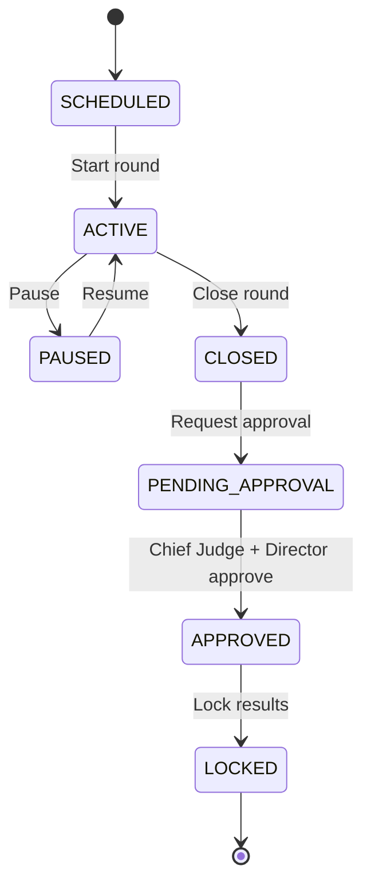

# Competition Operations Guide

This guide describes how officials run a competition day using AeroJudge — from morning setup through scoring, approval, printing, and publishing results.

---

## Roles on competition day

| Role | Primary app | Responsibilities |
|------|-------------|------------------|
| Competition Director | Admin | Overall control, final approval, publish results |
| Chief Judge | Admin / Judge | Scoring oversight, chief approval, protests |
| Judge | Judge terminal | Enter distances, bullseyes, DNF/ABS |
| Scorekeeper | Admin | Confirm scores, manage flight order |
| Launch Marshal | Admin (optional) | Mark pilots launched / on deck |
| Display Operator | Display app | Venue screens |

---

## Pre-competition checklist

0. **Organization** — Ensure the owning federation/club exists under Admin → Organizations (branding, contact, defaults). New competitions must select an organization.
1. **Competition status** — Set to `REGISTRATION` or `OFFICIAL` in Admin → Competitions
2. **Settings review** — Admin → Settings: confirm FAI rule profile, team size (3+1), discard rules, approval requirements
3. **Pilot registration** — Admin → Pilots: manual entry or CSV import; assign pilot numbers
4. **Team validation** — Admin → Teams: assign members, run **Validate** (ensures 3 scoring pilots + reserve)
5. **Staff accounts** — Admin → Users: assign competition roles (Judge, Chief Judge, etc.)
6. **Display layouts** — Configure venue screens (Top 10, Current Pilot, Sponsors)
7. **Weather** — Record wind direction/speed before each round (Admin or API)

---

## Morning of — Round setup

### 1. Create or open the round

Admin → **Rounds** → create round or select scheduled round.

Set:

- Round number and type (`PRACTICE` or `OFFICIAL`)
- Scheduled start time
- Wind conditions (optional, can update later)

### 2. Generate flight order

Admin → Rounds → **Generate flight order**

Options: `RANDOM`, `SEEDED`, `MANUAL`, `REVERSE`

Flight list appears on Judge terminal and Display board via Socket.IO.

### 3. Start the round

Admin → Rounds → **Start**

Status changes: `SCHEDULED` → `OPEN` → `ACTIVE`

Judges can now score; Display shows current/on-deck pilots.

---

## Live scoring (Judge terminal)

1. Judge logs in at **http://localhost:3001** (or `/judge/` in Docker)
2. Select active competition and round
3. For each pilot landing:
   - Tap **Bullseye** (0 cm) or enter distance on numeric keypad
   - Or select **DNF**, **ABS**, **DNS**, **Maximum**
4. Scorekeeper or second judge **confirms** score in Admin → Scoring
5. Offline mode: scores queue locally and sync when connectivity returns

### Score statuses

```
DRAFT → ENTERED → CONFIRMED → APPROVED → LOCKED
```

---

## Pausing and reflights

| Action | When | How |
|--------|------|-----|
| **Pause round** | Weather hold, safety stop | Admin → Rounds → Pause |
| **Resume** | Conditions OK | Admin → Rounds → Resume |
| **Reflight** | FAI-valid reflight granted | Create `REFLIGHT` round linked to parent; re-draw affected pilots |

---

## Closing a round

### 1. Close the round

Admin → Rounds → **Close**

All pilots must be scored or marked DNF/ABS/DNS. Status → `CLOSED` then `PENDING_APPROVAL`.

### 2. Request approval

Admin → Rounds → **Request approval** (or automatic if configured)

Notifications sent to Chief Judge and Competition Director.

### 3. Dual approval

| Approver | Action | API permission |
|----------|--------|----------------|
| Chief Judge | Approve or reject with comments | `score:approve_chief` |
| Competition Director | Approve or reject | `score:approve_director` |

Both must approve before round status → `APPROVED` → `LOCKED`.

### 4. Recalculate rankings

Admin → Rankings → **Recalculate**

The scoring engine applies discards, team totals, and tie-breaks. Results stored in `IndividualRanking`, `TeamScore`, `TeamRanking`.

---

## Printing official documents

Admin → **Reports**

| Report | When |
|--------|------|
| Round score sheet | After round close, before approval |
| Start list | Before round start |
| Intermediate results | Between rounds |
| Final results | After all official rounds approved |

Workflow:

1. **Generate** PDF preview
2. Chief Judge / Director **approves** print job
3. **Download** and print A4 copies for notice board
4. QR code on sheet links to public results URL

Print history is archived in `PrintHistory` with version tracking.

---

## Publishing results

### Round-level

After approval, round scores are visible to authenticated users immediately.

### Public leaderboard

1. Admin → Competitions → ensure **Live public results** enabled in settings
2. Admin → Rankings → **Publish**
3. Public URL: `http://localhost:3003/?slug=<publicSlug>` (e.g. `npha-acc-2024`)

Categories: Overall, Women, Junior, Team, Country.

---

## End of competition day

1. Confirm all official rounds are `LOCKED`
2. Publish final rankings
3. Generate and approve **Final Results** PDF
4. Set competition status → `COMPLETED`
5. Export audit log if required for FAI records (Admin → Audit)

---

## Emergency procedures

| Situation | Action |
|-----------|--------|
| Wrong score entered | Admin edits before confirmation; after lock, requires director unlock + audit entry |
| Server outage | Judges continue with offline queue; sync when API returns |
| Protest | Do not unlock round; record in audit; Chief Judge documents decision |
| Weather cancellation | Pause or cancel round; partial scores stand per FAI local rules |

---

## Quick reference — status flow



---

## Related documentation

- [API Reference — Approvals & Scores](../api/API.md#approvals)
- [Architecture — Approval workflow](../architecture/OVERVIEW.md#approval-workflow)
- [Installation Guide](INSTALLATION.md)
